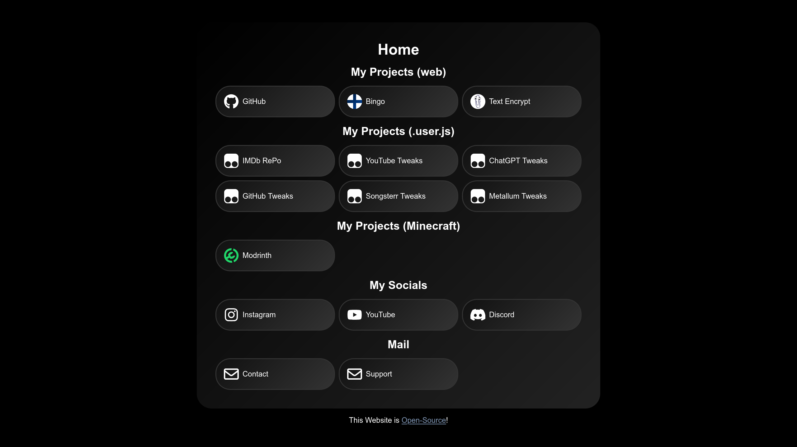
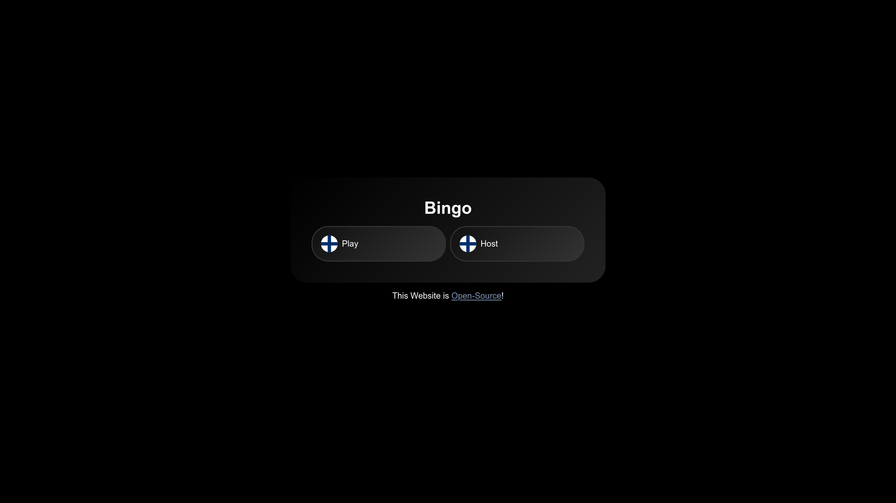
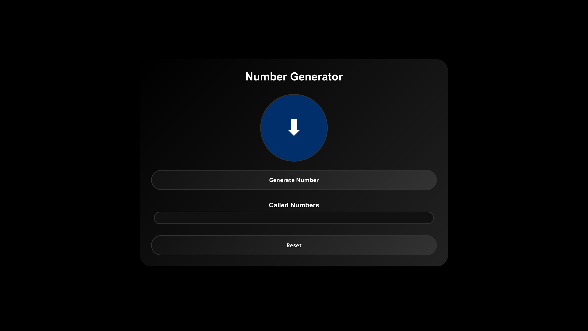
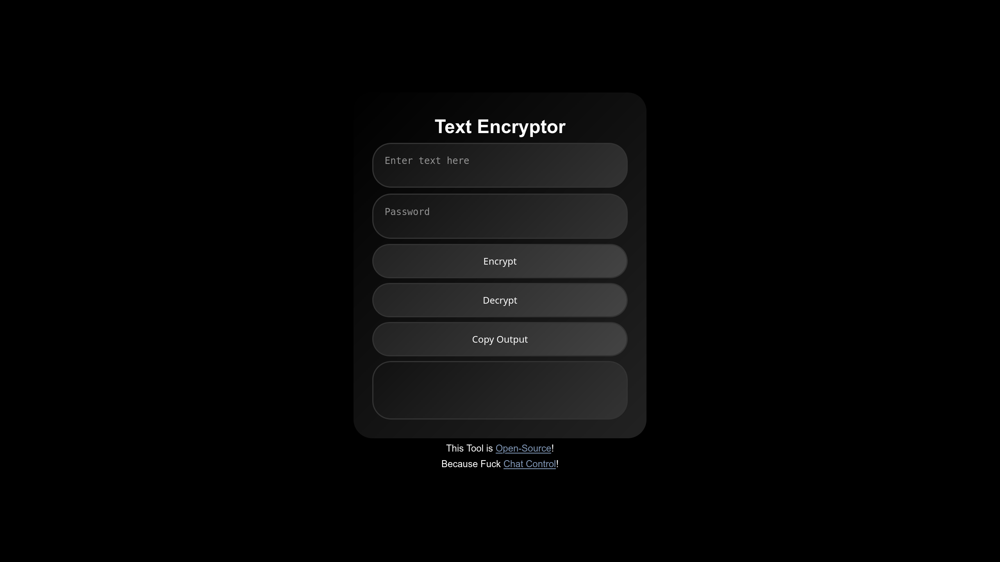

# Website | Nikoboi

This repository contains my website, which contains several lightweight, open-source web tools. All tools are fully client-side, easy to use, and open-source under the **GPLv3 License**.  

---

## Available Tools

| Site | Description | Live Demo | Source |
|------|------------|-----------|--------|
| **Home** | Simple site for easy access to all of my socials | [root](https://nikoboi.dev/) | [root](https://github.com/NikoboiNFTB/nikoboinftb.github.io/) |
| **Bingo** | Very simple, clean and Open-Source Bingo host and client. | [bingo](https://nikoboi.dev/bingo) | [bingo](https://github.com/NikoboiNFTB/nikoboinftb.github.io/tree/main/bingo)
| **Encryptor** | Easily encrypt and decrypt your messages, because fuck Chat Control. | [encrypt](https://nikoboi.dev/encrypt) | [encrypt](https://github.com/NikoboiNFTB/nikoboinftb.github.io/tree/main/encrypt) |
| **Open Links** | Quickly open multiple URLs in new browser tabs. | [links](https://nikoboi.dev/links) | [links](https://github.com/NikoboiNFTB/nikoboinftb.github.io/tree/main/links) |
| **Video Player** | Embed multiple 111Movies video URLs at once and download them using Video DownloadHelper. | [video-player](https://nikoboi.dev/video-player) | [video-player](https://github.com/NikoboiNFTB/nikoboinftb.github.io/tree/main/video-player) |

---

## Home

A simple, free and open-source portal where all of my public social media accounts can be found. The code is also reusable, so others can create their own social portals based on this project (feel free to do so :D).

### Features

- Centralized hub for all social media links.  
- Clean, minimal interface.  
- Fully open-source and easily forkable for personal use.

### Usage

1. **Open Live Version:**  
   [https://nikoboi.dev/](https://nikoboi.dev/)  
   Or Download & Run/Edit Locally:  
   The main HTML file is `index.html`, and the main CSS file is `style.css`.

### Screenshot

---

## Bingo

A simple, free and open-source Bingo game.

### Features

- Separate Play and Host views.  
- Clean, minimal interface.  
- Fully open-source and easily forkable for personal use.

### Usage

**Open Live Version:**  
   [https://nikoboi.dev/bingo](https://nikoboi.dev/bingo)  
   Or Download & Run Locally (not recommended, as you wont have HTTPS, which is annoying on *some* secure browsers):  
   1. Clone this repository, in terminal, run;  
   `git clone https://github.com/NikoboiNFTB/nikoboinftb.github.io`  
   `cd nikoboinftb.github.io`  
   2. Start a Python server;  
      `python3 -m http.server 5500`  
   >> Requires Python  
   3. Visit the server;  
   Run `firefox http://127.0.0.1:5500/bingo/index.html` in the terminal.  
   Or open `http://<PC-ip>:5500/bingo/index.html` on any device in your LAN.

### Screenshots

  
  

---

## Text Encryption Tool

A lightweight, free, and open-source web tool to encrypt and decrypt text quickly. Perfect for small messages or learning about simple encryption techniques. The code is reusable, so you can modify or integrate it into your own projects.  

### Features

- Encrypt and decrypt text in the browser.  
- Simple, intuitive interface.  
- Fully open-source and easily forkable for personal use.

### Usage

Open Live Version: [https://nikoboi.dev/encrypt/](https://nikoboi.dev/encrypt/)  
or Download and Run locally (recommended)  
1. Create a folder anywhere, open the terminal in it and run `git clone https://github.com/NikoboiNFTB/nikoboinftb.github.io`  
2. Run `cd nikoboinftb.github.io/encrypt/`  
3. On Linux, just run `xdg-open index.html`  
4. On Windows (or Linux if you want), run the following;  
`python3 -m http.server 5500`  
  >> Requires Python  
5. Then just open in your browser: [http://localhost:5500/encrypt/](http://localhost:5500/encrypt/)

---

## Open Links

A lightweight tool for opening multiple URLs at once in new tabs. Useful for bulk opening tabs. A great extra tool to use with [Link Gopher](https://addons.mozilla.org/en-US/firefox/addon/link-gopher/?utm_source=addons.mozilla.org&utm_medium=referral&utm_content=search) (just as they likely intended "... or copy and paste into other systems").

### Features

- Open multiple URLs in a single click.  
- Ignores invalid links (must start with `http://` or `https://`).  
- Clean, dark-themed interface.  
- Fully client-side; no data is sent anywhere.  
  - Well, GitHub is owned by Microsoft, so... Download it and run locally if you want FULL privacy.  
  - (And use Linux)

### Usage

1. **Open Live Version:**  
   [https://nikoboi.dev/links](https://nikoboi.dev/links)  
   Or Download & Run Locally:  
   Clone the repository and open `links/index.html`.  
   - Technically even better for privacy, since not even GitHub can track you anymore  

2. Paste URLs (one per line), click **Open All Links**, or **Clear Links** to reset.

### Example input:  
https://github.com/NikoboiNFTB  
https://www.instagram.com/nikoboi  
https://www.youtube.com/@NikoboiNFTB  
(shameless plug)

### Screenshot

---

## Video Player

A web app that allows you to bulk add video players from 111Movies. Videos can then be downloaded using the [Video DownloadHelper](https://www.downloadhelper.net/) extension for Firefox.

### Features

- Paste multiple 111Movies URLs (one per line).  
- Embed multiple video players at once and remove them all with one click.  
- Shows the total number of added players.  
- Supports downloading videos via Video DownloadHelper.

### Usage

1. **Open Live Version:**  
   [https://nikoboi.dev/video-player](https://nikoboi.dev/video-player)  
   Or Download & Run Locally:  
   Clone the repository and open `video-player/index.html` in Firefox.  

2. Paste your URLs, click **Add Players**, then download via Video DownloadHelper.  
3. Clear all players with **Clear All** if needed.  
> Recommended to download a few players at a time for best performance.

### Screenshot

---

## Repository Structure

nikoboinftb.github.io/  
│  
├── assets/  
│   ├── screenshot/  
│   ├── svg/  
│   └── clippy.png  
│  
├── bingo/  
│   ├── client/  
│   │   ├── index.html  
│   │   ├── script.js  
│   │   └── style.css  
│   ├── host/  
│   │   ├── index.html  
│   │   ├── script.js  
│   │   └── style.css  
│   ├── index.html  
│   └── style.css  
│  
├── encrypt/  
│   ├── index.html  
│   ├── script.js  
│   └── style.css  
│  
├── links/  
│   ├── index.html  
│   ├── script.js  
│   └── style.css  
│  
├── video-player/  
│   ├── index.html  
│   ├── script.js  
│   └── style.css  
│  
├── CNAME  
├── LICENSE  
├── README.md  
├── index.html  
└── style.css  

---

## License

All projects in this repository are licensed under the [GPLv3 License](LICENSE).

---

## Credits

- Created by **Nikoboi**  
- Script logic fine-tuned with **ChatGPT**  
- Colors inspired by the great nation of Finland 🇫🇮
